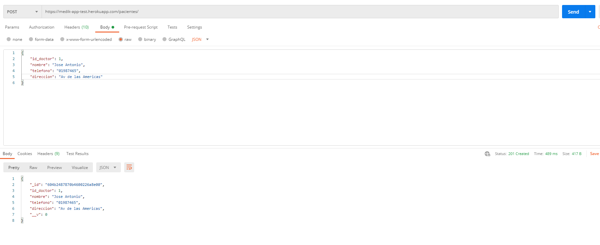
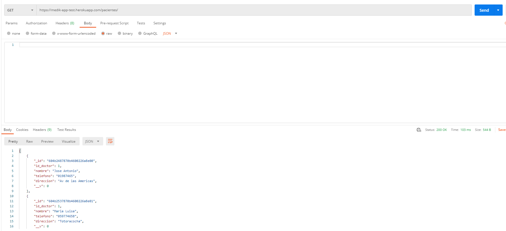
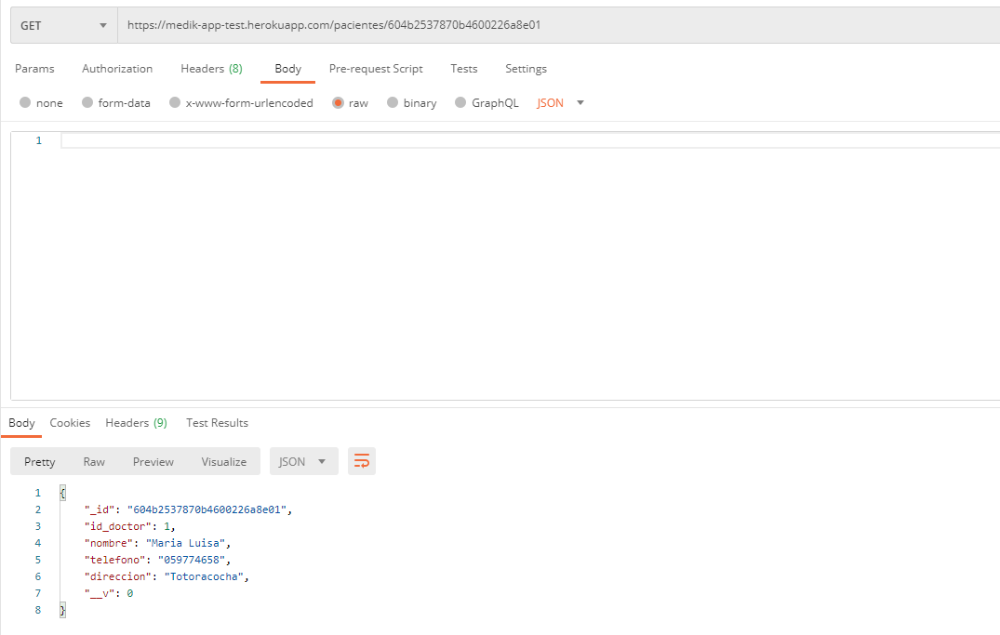
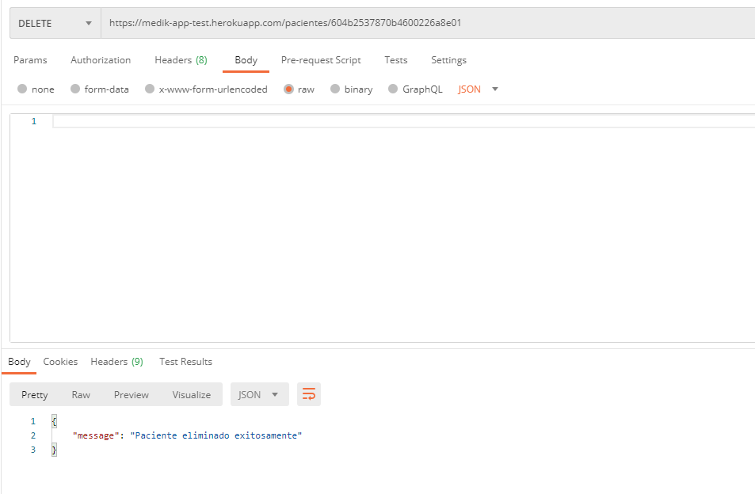
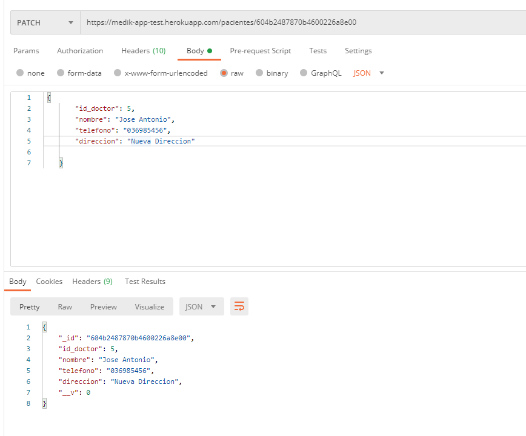

# Medikapp-test

Backend con Node - Express y MongoDB para el manejo de pacientes con una API rest

# Demo

👉 Puedes revisar la demo <a href="https://medik-app-test.herokuapp.com/">aquí</a>.
<br>

# Como usar la API

## Esquema de la base de datos

| Atributo  | Descripción            |
| --------- | ---------------------- |
| id        | id del paciente        |
| id_doctor | id del doctor          |
| nombre    | nombre del paciente    |
| telefono  | telefono del paciente  |
| direccion | direccion del paciente |

## API REST

Base url: [https://medik-app-test.herokuapp.com/pacientes](https://medik-app-test.herokuapp.com/pacientes)<br>
La URL base contiene información sobre todos los recursos de API disponibles. Todas las solicitudes son solicitudes GET,POST,DELTE,PATCH . Las respuestas devolverán datos en json.

<b>Se utilizará [Postman](https://www.postman.com/) para el uso de la API</b>

### 1. Crear un paciente

 `POST `
https://medik-app-test.herokuapp.com/pacientes

- En postman seleccionar el metodo post e ingresar la URL indicada
- En el body ingresar un objeto JSON con los datos del nuevo paciente

```json
{
  "id_doctor": 1,
  "nombre": "Juan perez",
  "telefono": "098158954",
  "direccion": "Enrique Segoviano"
}
```

- <b>Mongo automaticamente crea un id, por lo que no es necesario especificar el id del paciente</b>

# 

### 2. Obtener todos los pacientes

 `GET `
https://medik-app-test.herokuapp.com/pacientes

- En postman seleccionar el metodo get e ingresar la URL indicada

# 

### 3. Obtener un paciente por id

 `GET `
https://medik-app-test.herokuapp.com/pacientes/id

- En postman seleccionar el metodo get e ingresar la URL indicada reemplazando "id" por el id del paciente a buscar

# 

### 4. Eliminar un Paciente

 `DELETE `
https://medik-app-test.herokuapp.com/pacientes/id

- En postman seleccionar el metodo DELETE e ingresar la URL indicada reemplazando "id" por el id del paciente a eliminar

# 

### 5. Actualizar un Paciente

 `PATCH`
https://medik-app-test.herokuapp.com/pacientes/id

- En postman seleccionar el metodo PATCH e ingresar la URL indicada reemplazando "id" por el id del paciente a eliminar
- Adicionalmente se debe agregar al body los nuevos datos del paciente

# 

# Configuración de la aplicación Localmente

### Requisitos

- Node Js
- Cuenta Atlas MongoDB

### Proceso

- Descargar la carpeta de este repositorio
- Descomprimir
- Ejecutar dentro de la carpeta

```sh
$ npm install
```

- Crear un archivo llamado .env en la carpeta
- Agregar credenciales como el ejemplo provisto en el archivo .env.example

### Obtener credenciales de Mongodb Atlas

- Ingresar a mongo db atlas [aqui](https://www.mongodb.com/cloud/atlas) y crear una cuenta gratuita
- Crear un cluster en la versión gratuita
- Crear un usuario dentro del cluster creado en mongodb atlas
- En este caso se permitirá el acceso desde cualquier dirección ip por lo que no se necesita configurar esto en el cluster ya que por defecto permite cualquier dirección ip
- Obtener el link de conexión reemplazando las credenciales del usuario creado

- Ejecutar dentro del proyecto

```sh
$ npm start
```

## Desarrollado con

- [Node JS](https://nodejs.org/es/)
- [Express](https://www.npmjs.com/package/express)
- [Mongo DB Atlas](https://www.mongodb.com/cloud/atlas/)

## Deploy realizado con

- [Heroku](https://www.heroku.com/)

# Futuras mejoras y recomendaciones

- Validar valores nulos al momento de acualizar o agregar un nuevo paciente.
- Agregar una tabla llamada Doctores para manejar las relaciones y claves principales y foraneas dentro de las tablas
